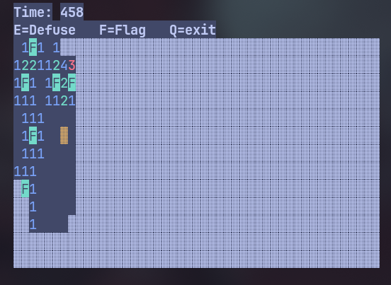

# rust-game-minesweeper

Minesweeper game (Rust)



### Keys:

A: Move left

D: Move right

S: Move down

W: Move top

E: Defuse cell

F: Flag cell

Q: Exit

## Installation

Use [Rust-installation](https://doc.rust-lang.org/cargo/getting-started/installation.html) to install Rust.
Or [Rust-other-installation-methods](https://forge.rust-lang.org/infra/other-installation-methods.html) if you are using windows.

Go to the game-minesweeper folder

```bash
cd game-minesweeper
```

Install deps

```bash
cargo install --path .
```

## Usage

Run inside game-minesweeper folder

```bash
cargo run
```

## Wanna faster?

Open `./game-minesweeper/src/config.rs` and change `GAME_SPEED` value:

example

```rust
pub const GAME_SPEED: u16 = 60;
```

To

```rust
pub const GAME_SPEED: u16 = 10;
```

or anything

### License

MIT. >>> [LICENSE](LICENSE)
